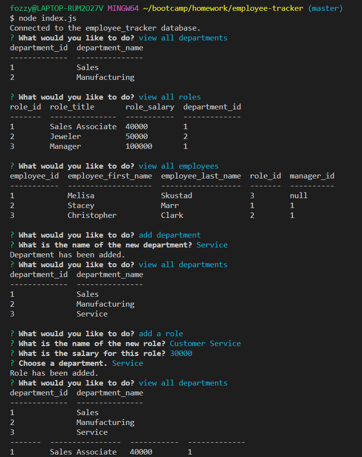
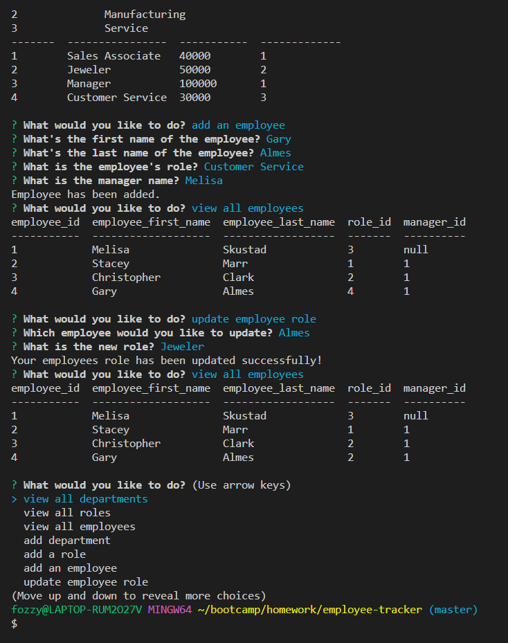

# Employee Tracker

## Project Summary

The Goal of this assignment is to create an easy to use Content Management System (CMS) that allows a user to create a database of their departments, roles and employees using the command line. This command-line application accepts user input to view all departments, view all roles, view all employees, add a department, add a role, add an employee, and update an employee role.

### Here is the link to a video demonstrating the final version of the project.

[Click here to watch a video demonstrating the Employee Tracker application.](https://drive.google.com/file/d/1Ao9Pmwrqm1J_u-eFX-b_41sfY7znN50a/view)

### This is a screen shot of the first half of terminal with the questions and responses for the Employee Tracker application.

### This is a screen shot of the second half of terminal with the questions and responses for the Employee Tracker application.

